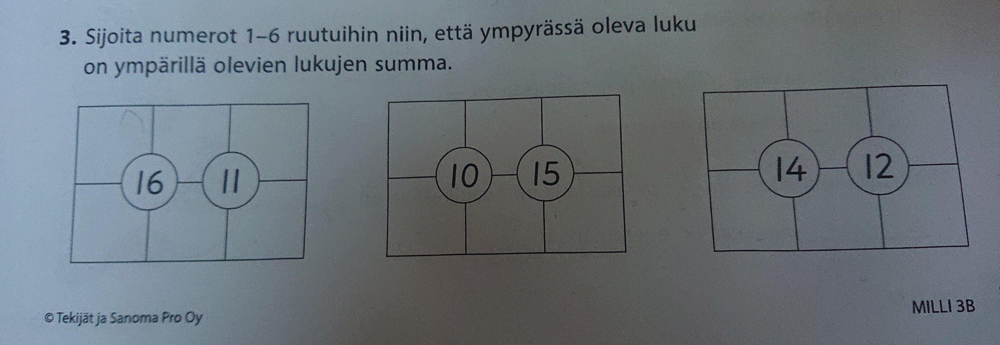

9-vuotiaan tyttäreni Lumin matematiikan harjoituksissa oli haastava tehtävä:

Tuntui kohtuuttomalta hommalta 3. luokkalaiselle käydä läpi kaikkien kolmen kohdan `6! = 720` mahdollista tapaa sijoittaa numerot, joten teimme nopeasti yhdessä peruuttavaan hakuun perustuvan algoritmin, joka tulostaa tehtävän kaikki ratkaisut ja ratkaisujen määrän.

Emme ole mitään Python-velhoja, mutta oletamme ohjelman toimivan millä tahansa Python-versiolla. Koodi on melko itsensä selittävää, mutta tehtävässä ratkaistavia summia voi muuttaa vaihtamalla muuttujien `a` ja `b` arvoja.